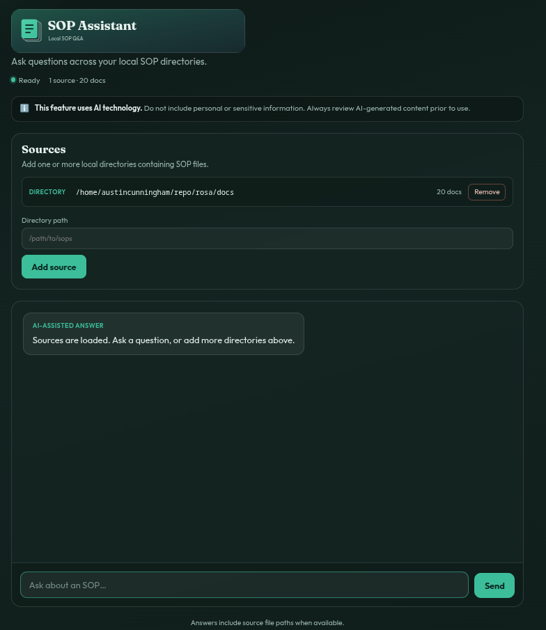

# About

AI chatbot for SOP libraries. Loads markdown, asciidoc, and text files from **local directories**, then answers questions via Ollama (mistral) with source citations.



# Prereq

- ollama https://ollama.com/download/linux
- python 3
- c++ > 11

# setup

```bash
ollama run mistral
```

```bash
sudo dnf install gcc-c++ python3-devel
python3 -m venv venv
source venv/bin/activate
pip install -r requirements.txt
```

# Running

Start the web GUI (optionally with one or more directories):

```bash
python main.py
python main.py /path/to/sops
python main.py /path/a /path/b
```

With no arguments the app starts empty — use the **Sources** panel in the UI to add directories. Open http://127.0.0.1:5000

## Arguments

| Argument | Description |
| --- | --- |
| `sources` | Zero or more local SOP directories (positional). |
| `--cli` | Run terminal chat instead of the web GUI. Requires at least one indexed source. |
| `--host` | Web server host (default: `127.0.0.1`). |
| `--port` | Web server port (default: `5000`). |
| `--model` | Ollama model name (default: `mistral`). |

Examples:

```bash
python main.py /path/to/sops --host 0.0.0.0 --port 8080
python main.py /path/to/sops --model llama3.2
python main.py /path/to/sops --cli
```

## Environment

If no directories are passed on the command line, these are used (first wins):

| Variable | Description |
| --- | --- |
| `SOP_DIR` | Single local SOP directory. |
| `SOP_SOURCES` | Path-separated list of directories (`:` on Linux/macOS, `;` on Windows). |
